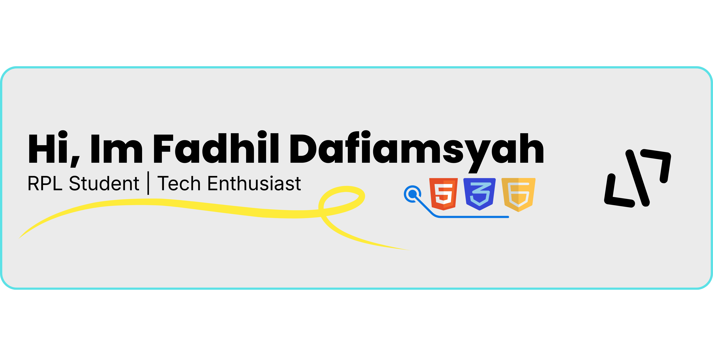

<header>
  

    
  

</header>

 

<h3 align="left">📈 My Stats:</h3>

  
  

  

###

  

 

<h3 align="left">🛠️ Tech Stack & Tools:</h3>

  
  
  
  
  
  
  
  
  
  
  
  
  
  
  
  
  
  
  

###

 

<h3 align="left">📸 Social Media:</h3>

  
  
  
  
  
  
  
  
  

###

 

  

###

  

  

###
